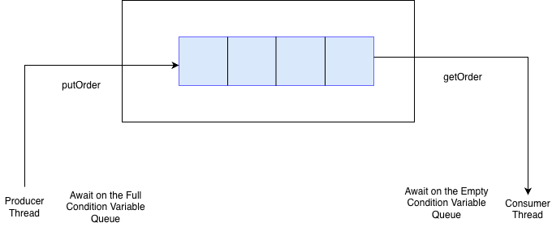

# Simulating the Bounded Buffer Problem on a Restaurant
For this project, I am simulating the bounded buffer problem with mutiple threads of consumers and producers and then adding in synchronization primitives.

Based on the diagram, to ensure that the shared state do not get modified concurrently, we use a mutex to ensure only one producer or consumer is in the critical section. We also use condition variables to allow for efficient waiting for a specific state change while releasing the lock.

The producer would sleep on the Full Condition as it is not able to produce more items on the bounded buffer while the consumer would sleep on the Empty Condition as it would not be able to consumer any items from the buffer.

## Specifications of the Projects

### Queues
1. Order Placement Queue - This is where the waiters would place orders and the Chef would also take the orders from to prepare in the Kitchen
2. Prepared Order Queue - This is where the chefs would place the orders that have been prepared and then the waiters would collect them and serve to the customer.

### Roles
1. Waiters - They add orders to the Order Placement Queue from the customers and consume from Prepared Order Queue to serve to the customer
2. Chefs - They consumer orders from the Order Placement Queue to know which order to prepare and then produce the prepared orders on the Prepared Order Queue.

## Running the Program

` javac -d out $(find . -name "*.java")`
` java -cp out Restaurant.java`

